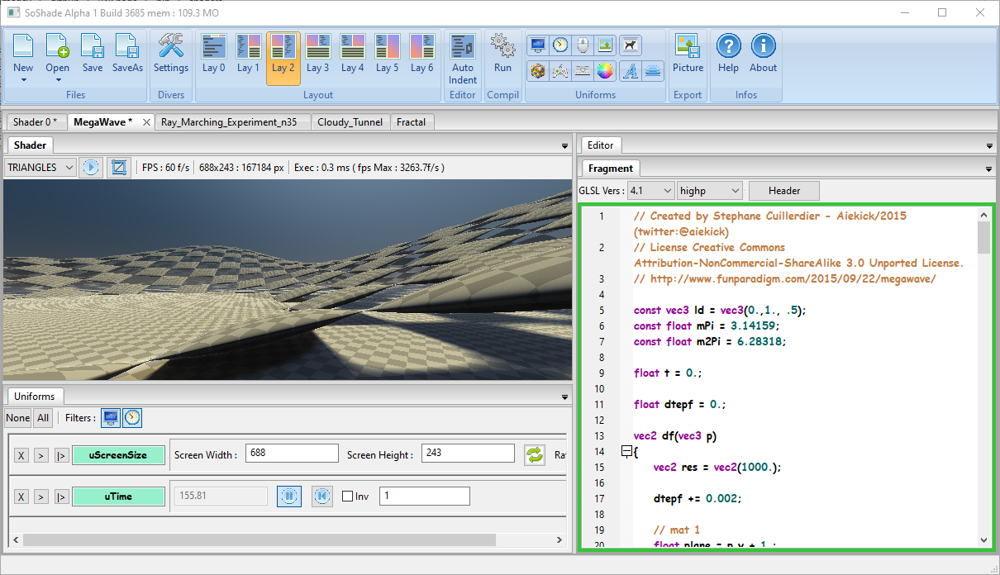
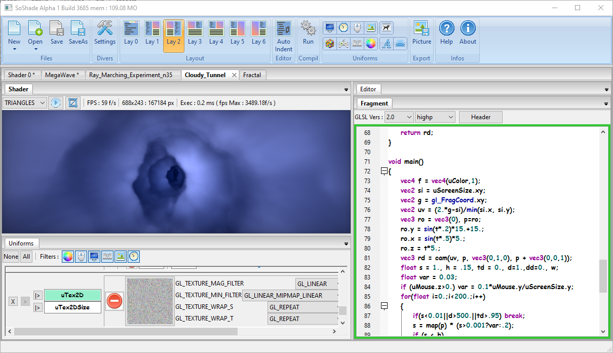

# wxShade

this project was my second iteration of a ShaderEditor started in 2015.

but i not work on it since 2015 and its not planed
take it and do what you want witn him.

btw he is stable enough for active use :) 
a bit more easy for starting guy in shader dev

like said he was the second iteration of my Shader Editor
the third was SoShade for the multipass and other cool things (not released)
the last and more powerfull is [NoodlesPlate](https://github.com/aiekick/NoodlesPlate)

pictures :

